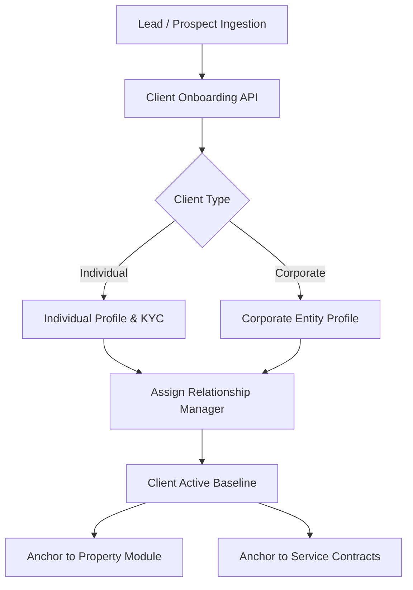
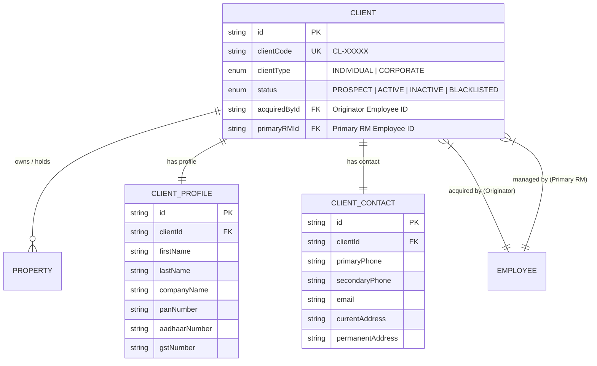
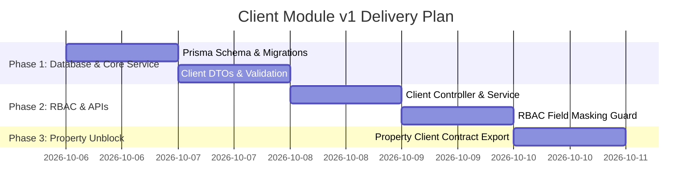

# Business Requirements Document (BRD): Client Module (v1)

**Document Version:** 1.0.0  
**Status:** Approved for v1 Foundation  
**Target Module:** Client Management Domain (`apps/api/src/modules/client`)  
**Unblocks:** Property Module, Service Engine, Sales & Billing  

---

## 1. Executive Summary & Objective

The **Client Module** serves as the primary operational anchor of Lands & Lands ERP. All business services—including Property Registration, Legal Vetting, Layout Development, Sales, and Financial Agreements—revolve around a Client. 

To unblock the upcoming **Property Module** while final business specifications are being refined by the business team, this v1 BRD establishes:
1. A flexible **Client Core Model** (Individual & Corporate stakeholders).
2. **Role & Permission-Gated Visibility** for Client PII (Personally Identifiable Information).
3. **Inter-Module Contract** anchoring `clientId` for Property and future service connections.

---

## 2. Business Workflows & Scope

### 2.1 Core Business Rules
1. **Unique Client Identifier**: Auto-generated identifier (`CL-XXXXX`).
2. **Client Types**:
   - `INDIVIDUAL`: Direct property buyers, sellers, landowners.
   - `CORPORATE`: Companies, trusts, partnerships, developers.
3. **2-Tier Relationship & Ownership Model**:
   - **`acquiredById` (Account Level)**: Immutable reference to the employee who brought the client to Lands & Lands. Used for lifetime attribution & referral metrics.
   - **`primaryRMId` (Account Level)**: Primary Relationship Manager for general account stewardship.
   - **`assignedExecutiveId` (Service/Property Level)**: Contextual employee assigned to handle a specific property or service engagement (e.g. Executive A brought client; Executive B handles a new legal service for the same client).
4. **Data Isolation & Visibility Rules**:
   - **Super Admin / Executive Leadership**: Unrestricted view across all clients and sensitive data.
   - **Account Originator (`acquiredById`)**: Global read visibility across all services for their client.
   - **Service Lead (`assignedExecutiveId`)**: Full operational access to their active service transaction + basic client view.
   - **General Employee / Other Verticals**: Masked access (Name & Client Code visible; PII masked).

---

## 3. Data Model Architecture (v1 Baseline)

---

## 4. Security, Roles & Field-Level Access Matrix

| Role / Permission | Client Code & Name | Phone & Email | Govt Tax IDs (PAN/Aadhaar) | Financial / Property Records | Edit / Delete |
|---|---|---|---|---|---|
| **SUPER_ADMIN / HR_ADMIN** | Full | Full | Full | Full | Full |
| **Assigned RM (Relationship Mgr)** | Full | Full | Full | Full | Edit Only |
| **Vertical Head** | Full | Full | Masked (`XXXXX1234X`) | Full | View Only |
| **General Employee** | Full | Masked (`+91******321`) | Hidden (`null`) | Hidden (`null`) | No Access |

---

## 5. API Endpoint Specifications (v1 Foundation)

### 5.1 Client Management APIs
- **`POST /api/v1/clients`**: Create new client record (Individual/Corporate).
- **`GET /api/v1/clients`**: List clients with pagination, filters, and dynamic RBAC field masking.
- **`GET /api/v1/clients/:id`**: Get detailed client profile (Gated by access rules).
- **`PUT /api/v1/clients/:id`**: Update client details.
- **`PATCH /api/v1/clients/:id/assign`**: Reassign client to a different Relationship Manager.

### 5.2 Property Module Integration Contract
- **`GET /api/v1/clients/:id/properties`**: Retrieve all properties associated with client.
- Foreign Key Contract in Property schema: `Property.clientId -> Client.id`.

---

## 6. Implementation Roadmap

