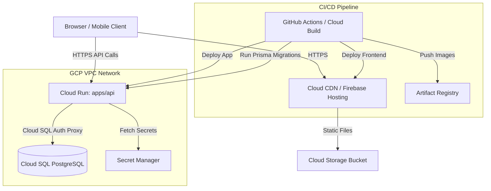

# GCP Deployment Plan & Cloud Architecture

## Executive Summary

Deployment plan for **Lands & Lands ERP** monorepo on Google Cloud Platform (GCP).

### Stack Overview
* **Frontend (`apps/web`)**: React + Vite SPA.
* **Backend (`apps/api`)**: NestJS + Prisma ORM.
* **Database**: PostgreSQL 16.

---

## Recommended Architecture (Serverless & Cost-Effective)



---

## Component Selection & Cost Comparison

| Component | Architecture Choice | Reason | Estimated Monthly Cost |
| :--- | :--- | :--- | :--- |
| **Frontend** | **Firebase Hosting** (or GCS + Cloud CDN) | Global CDN, free SSL, zero management, custom domain support. | **$0 - $1** (10GB free transfer) |
| **Backend API** | **GCP Cloud Run** | Fully managed container runtime, scales 0 to N, native SSL & custom domain. | **$0 - $5** (Free tier: 180k vCPU-s/mo) |
| **Database** | **Cloud SQL (PostgreSQL)** | Managed backups, automated patching, native VPC integration. | **$7 - $12** (`db-f1-micro` shared instance) |
| **Container Registry** | **Artifact Registry** | Secure image storage for NestJS containers. | **$0.10** |
| **Secrets** | **Secret Manager** | Encrypted store for `DATABASE_URL`, `JWT_SECRET`, etc. | **$0.06** |
| **Total Estimated Cost** | | | **~$8 - $15 / month** |

---

## Implementation Steps

### 1. Containerization

#### Backend Dockerfile (`apps/api/Dockerfile`)
```dockerfile
FROM node:20-alpine AS builder
RUN corepack enable && corepack prepare pnpm@12.4.1 --activate
WORKDIR /app

COPY package.json pnpm-lock.yaml pnpm-workspace.yaml turbo.json ./
COPY apps/api/package.json ./apps/api/
COPY packages/shared/package.json ./packages/shared/

RUN pnpm install --frozen-lockfile

COPY packages/shared ./packages/shared
COPY apps/api ./apps/api

RUN pnpm --filter @landsandlands/shared build
RUN pnpm --filter api build
RUN pnpm --filter api db:generate

FROM node:20-alpine AS runner
WORKDIR /app
ENV NODE_ENV=production

COPY package.json pnpm-lock.yaml pnpm-workspace.yaml ./
COPY apps/api/package.json ./apps/api/
COPY packages/shared/package.json ./packages/shared/

RUN corepack enable && corepack prepare pnpm@12.4.1 --activate && pnpm install --prod --frozen-lockfile

COPY --from=builder /app/packages/shared/dist ./packages/shared/dist
COPY --from=builder /app/apps/api/dist ./apps/api/dist
COPY --from=builder /app/apps/api/prisma ./apps/api/prisma
COPY --from=builder /app/node_modules ./node_modules

EXPOSE 3000
CMD ["node", "apps/api/dist/main"]
```

---

### 2. Infrastructure Setup (`gcloud` CLI)

```bash
# 1. Enable GCP Services
gcloud services enable \
  run.googleapis.com \
  sqladmin.googleapis.com \
  secretmanager.googleapis.com \
  artifactregistry.googleapis.com \
  cloudbuild.googleapis.com

# 2. Create Artifact Registry repository
gcloud artifacts repositories create erp-repo \
  --repository-format=docker \
  --location=us-central1

# 3. Create Cloud SQL Instance (PostgreSQL 16)
gcloud sql instances create erp-postgres-db \
  --database-version=POSTGRES_16 \
  --tier=db-f1-micro \
  --region=us-central1 \
  --storage-size=10GB \
  --storage-auto-increase

# 4. Set DB Password & Create Database
gcloud sql users set-password postgres --instance=erp-postgres-db --password=SECURE_DB_PASSWORD
gcloud sql databases create erp_prod_db --instance=erp-postgres-db

# 5. Store Secrets in Secret Manager
echo -n "postgresql://postgres:SECURE_DB_PASSWORD@/erp_prod_db?host=/cloudsql/PROJECT_ID:us-central1:erp-postgres-db" | \
  gcloud secrets create DATABASE_URL --data-file=-

echo -n "YOUR_RANDOM_JWT_SECRET_KEY" | \
  gcloud secrets create JWT_SECRET --data-file=-
```

---

### 3. Deploy Backend to Cloud Run

```bash
# Build and push container image
gcloud builds submit --tag us-central1-docker.pkg.dev/PROJECT_ID/erp-repo/api:latest -f apps/api/Dockerfile .

# Deploy to Cloud Run with Cloud SQL Connection & Secrets
gcloud run deploy erp-api \
  --image=us-central1-docker.pkg.dev/PROJECT_ID/erp-repo/api:latest \
  --region=us-central1 \
  --platform=managed \
  --allow-unauthenticated \
  --add-cloudsql-instances=PROJECT_ID:us-central1:erp-postgres-db \
  --set-secrets=DATABASE_URL=DATABASE_URL:latest,JWT_SECRET=JWT_SECRET:latest \
  --set-env-vars=NODE_ENV=production,PORT=3000 \
  --min-instances=0 \
  --max-instances=5 \
  --memory=512Mi \
  --cpu=1
```

---

### 4. Database Migrations

Run database migrations via Cloud Run Job before deployment:

```bash
# Execute Prisma Migration Job
gcloud run jobs create erp-db-migrate \
  --image=us-central1-docker.pkg.dev/PROJECT_ID/erp-repo/api:latest \
  --region=us-central1 \
  --add-cloudsql-instances=PROJECT_ID:us-central1:erp-postgres-db \
  --set-secrets=DATABASE_URL=DATABASE_URL:latest \
  --command="pnpm" \
  --args="--filter,api,db:deploy"

gcloud run jobs execute erp-db-migrate --region=us-central1
```

---

### 5. Deploy Frontend (`apps/web`)

**Option A: Firebase Hosting (Recommended)**
```bash
# Install Firebase CLI & Initialize
npm i -g firebase-tools
firebase login
firebase init hosting

# Build static bundle
pnpm --filter web build

# Deploy output dist/ directory
firebase deploy --only hosting
```

---

## Security & Reliability Best Practices

1. **IAM & Least Privilege**: Use dedicated Service Account for Cloud Run with `Cloud SQL Client` and `Secret Manager Secret Accessor` roles.
2. **Database Access**: Keep Cloud SQL IP private (or rely exclusively on Cloud SQL Auth Proxy socket connections).
3. **Environments**: Separate GCP Projects for `staging` and `production`.
4. **Monitoring**: Enable Cloud Logging & Cloud Monitoring for automatic error alerts.
