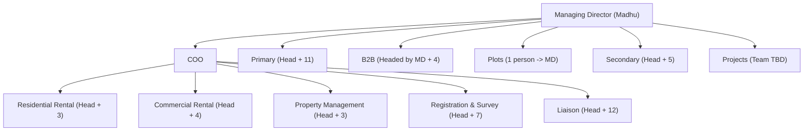
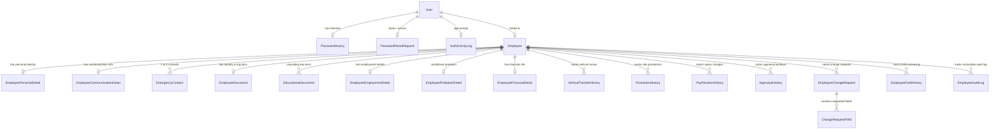

# Database Schema Design & ER Diagram - Employee Module (ERP 5.0)

Design of relational database schema and ER Diagram based on the 44 data points across 6 sections, system metadata, change request workflows, authentication tables, and Organisation Hierarchy.

---

## 🏛️ Organisation Structure & Hierarchy Integration

### Impact on Database Design & Business Logic:

1. **Master Data Seed (`verticals` enum / lookup)**:
   - **Direct Verticals under MD**: `PRIMARY`, `B2B`, `PLOTS`, `SECONDARY`, `PROJECTS`.
   - **Service Verticals under COO**: `RESIDENTIAL_RENTAL`, `COMMERCIAL_RENTAL`, `PROPERTY_MANAGEMENT`, `REGISTRATION_SURVEY`, `LIAISON`.
   - **Functional Verticals**: `MARKETING`, `SALES`, `OPERATIONS`, `HUMAN_RESOURCE`, `FINANCE_ADMIN`.

2. **Hierarchical Reporting Tree (`reportingAuthorityId`)**:
   - **Top Node**: MD (`reportingAuthorityId = null`).
   - **Level 1**: COO and Vertical Heads of Primary, Plots, Secondary, Projects (`reportingAuthorityId = MD.id`).
   - **Level 2 (Service Heads)**: Heads of Residential Rental, Commercial Rental, Property Management, Registration & Survey, Liaison (`reportingAuthorityId = COO.id`).
   - **Level 3 (Team Members)**: Team members report to their respective Vertical Head.

3. **Subordinate Privacy Filter Engine (`FR-12`)**:
   - Recursive SQL query on `reportingAuthorityId` tree calculates all direct and indirect subordinates for any Vertical Head.
   - Automatically masks **Restricted Data** fields when fetched by a Vertical Head viewing their team.

---

## 🖼️ Visual ER Diagram

---

## 🗺️ Interactive Mermaid ER Diagram

